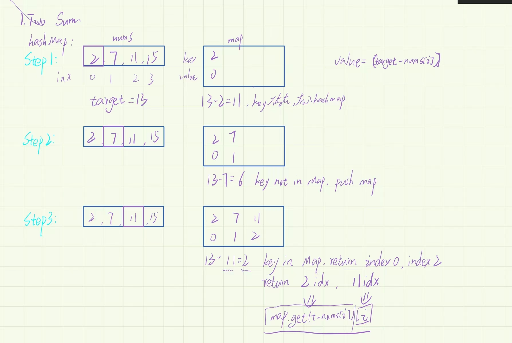

> 两数之和：建立哈希表，用target减去nums得到res，检测哈希表里有无res




```
    /**
     * @param {number[]} nums
     * @param {number} target
     * @return {number[]}
     */
    var twoSum = function (nums, target) {
      const map = new Map();
      for (let i = 0; i < nums.length; i++) {
        if (map.has(target - nums[i])) {
          return [map.get(target - nums[i]), i];
        } else {
          map.set(nums[i], i);
        }
        return [];
      }
    };


```
