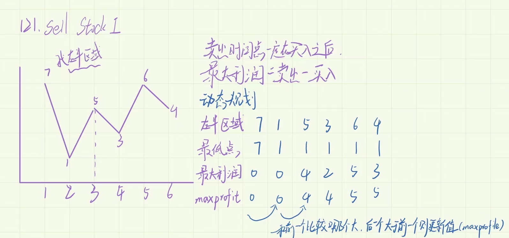

## 买卖股票的最佳时期1

- 因为卖出的时间点一定在买入之后，所以买入的时间点一定在卖出的时间点的左半区域

- 又因为左半边区域的最大利润=卖出-买入

- 所以可以使用动态规划来比较最大利润的值



```
    /**
     * @param {number[]} prices
     * @return {number}
     */
    var maxProfit = function (prices) {
      if ((prices.length = 0)) {
        return 0;
      }
      let minPri = prices[0];
      maxPri = 0;
      for (let i = 0; i < prices.length; i++) {
        if (prices[i] < minPri) {
          minPri = prices[i];
        } else if (prices[i] - minPri > maxPri) {
          maxPri = prices[i] - minPri;
        }
      }
      return maxPri;
    };
```
