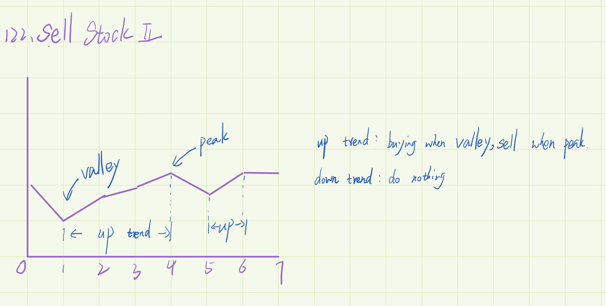

> 买卖股票的最佳时期,见图



```
/**
     * @param {number[]} prices
     * @return {number}
     */
    var maxProfit = function (prices) {
      if (prices.length === 0) {
        return 0;
      }
      let profit = 0,
        valley = prices[0],
        peak = prices[0];
      let i = 0;
      while (i < prices.length - 1) {
        //判断是否呈上升趋势，是的话加i++，且最低值等于i的索引
        while (i < prices.length - 1 && prices[i] >= prices[i + 1]) {
          i++;
        }
        valley = prices[i];
        //下降趋势：
        while (i < prices.length - 1 && prices[i] <= prices[i + 1]) {
          i++;
        }
        peak = prices[i];
        profit += peak - valley;
      }
      return profit;
};
```
    