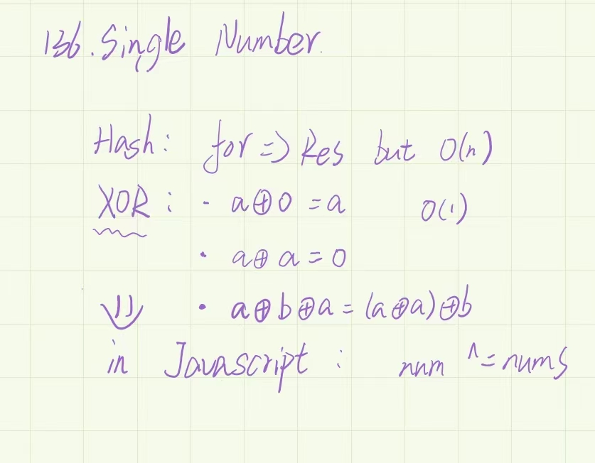

> 只出现一次的数字，使用到*异或运算*





``` 
  /**
  * @param {number[]} digits
  * @return {number[]}
  */
 var plusOne = function (digits) {
   for (let i = digits.length - 1; i >= 0; i--) {
     //不等于9的话直接+1
     if (digits[i] !== 9) {
       digits[i]++;
       return digits;
     } else {
       //等于9 直接把i设为0，剩下的数会到循环中
       digits[i] = 0;
     }
   }

   const res = [1, ...digits];
   //或者写成:
   //[1].concat(digits)
   return res;
 };
```