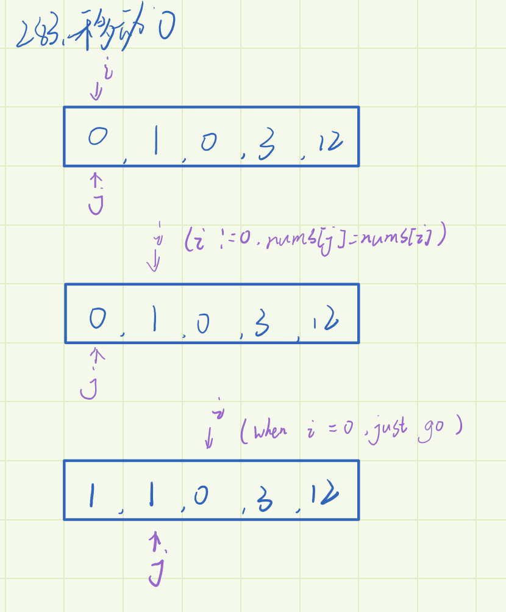

## 移动零
- 把非零的数组移动到最前面，并且把后面的都设置为0

_

```
    let nums = [0, 1, 0, 3, 12];
    var moveZeroes = function (nums) {
      let j = 0;
      for (let i = 0; i < nums.length; i++) {
        if (nums[i] !== 0) {
          nums[j] = nums[i];
          j++;
        }
      }
      for (i = j; j < nums.length; j++) {
        nums[i] = 0;
      }

      return nums;
    };
```
