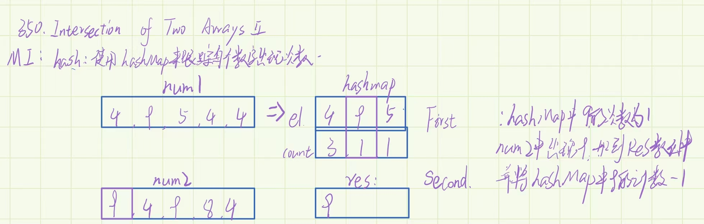

## 两个数组的交集 II




```
/**
* @param {number[]} nums1
* @param {number[]} nums2
* @return {number[]}
*/
var intersect = function (nums1, nums2) {
 if (nums1.length < nums2.length) {
   [nums1, nums2] = [nums2, nums1];
 }
 const map = new Map();
 const res = [];
 for (let num1 of nums1) {
   if (map[num1]) {
     map[num1]++;
   } else {
     map[num1] = 1;
   }
 }
 for (let num2 of nums2) {
   const val = map[num2];
   if (val > 0) {
     res.push(num2);
     map[num2]--;
   }
 }
 return res;
};

```
